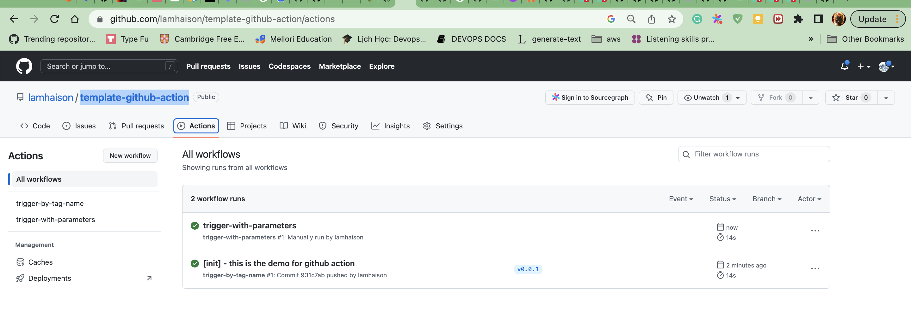

# This is the demo for github action.

## What is the demo?
* Trigger by tags: when making a tag with format vx.y.z. The instruction of trigger-by-tab-name.yml will be run
* Trigger by parameters: when you want to run the script with some parameters, you can use this script to run

### Granting permissions
* Access the site - https://github.com/settings/tokens
* To create classic token (Generate new token (classic) For general use)
* Granting repo, workflow permissions

* Get the Token and keep it secret

### Trigger by scripting

### Trigger by bashshell commandline.
```sh
curl \
  -X POST \
  -H "Accept: application/vnd.github+json" \
  -H "Authorization: Bearer YOUR_TOKEN"\
  -H "X-GitHub-Api-Version: 2022-11-28" \
  https://api.github.com/repos/lamhaison/template-github-action/actions/workflows/trigger-with-parameters.yml/dispatches \
  -d '{"ref":"main","inputs":{"is_start":"true"}}'
```

### Trigger by python code
* Install dependencies

```
pip3 install requests

```

* Python code
python3 script_name.py

```python
import json
import os
import requests


def lambda_handler():
    
    # get github_auth_token from environment variable
    github_auth_token = "YOUR_TOKEN"

    deploy_headers = {
        "Accept" : "application/vnd.github.everest-preview+json",
        "Authorization": "Bearer " + github_auth_token
    }

    OWN = "lamhaison"
    REPO = "template-github-action"
    WF_ID = "push-file-to-s3.yml"

    API_URL = "https://api.github.com/repos/{}/{}/actions/workflows/{}/dispatches".format(OWN,REPO,WF_ID)
    print("api_url {}".format(API_URL))

    deploy_body_data = {
        "ref": "main",
        "inputs": {
            "is_start": "true"
        }
    }

    response = requests.post(API_URL, data=json.dumps(deploy_body_data).encode(), headers=deploy_headers)
    print('Status_Code {}, Response {}'.format(response.status_code, response.content))

if __name__ == '__main__':
    lambda_handler()
```

## Result
* You can trigger by tags or run the job manually with some parameters.


## References
* [How to create a token](https://docs.github.com/en/authentication/keeping-your-account-and-data-secure/creating-a-personal-access-token)